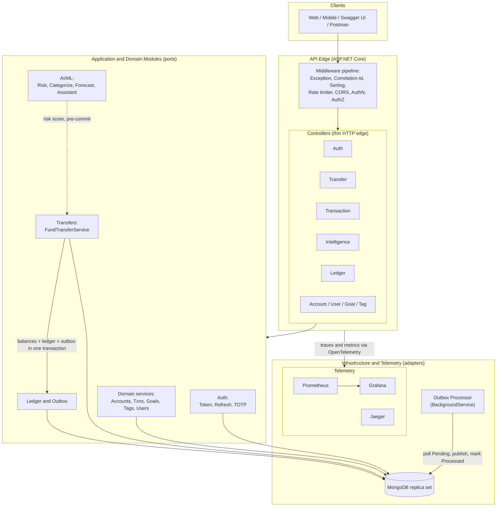
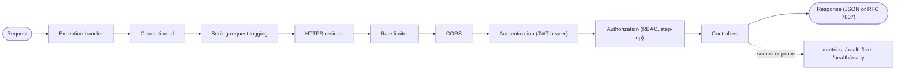
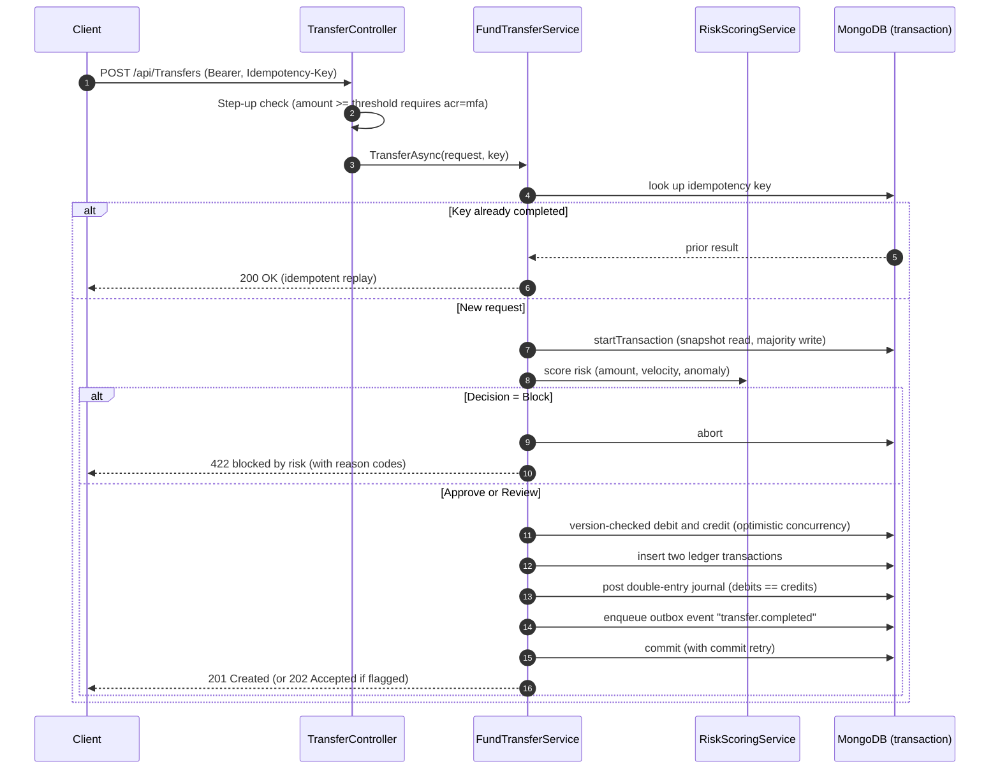
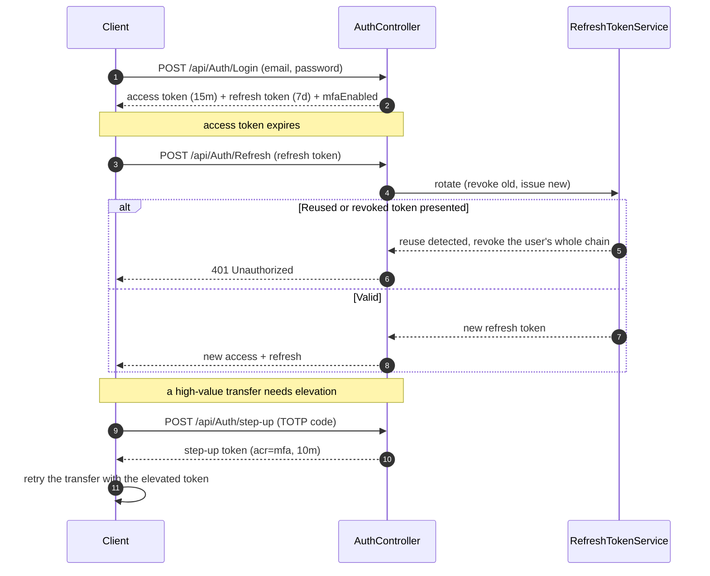
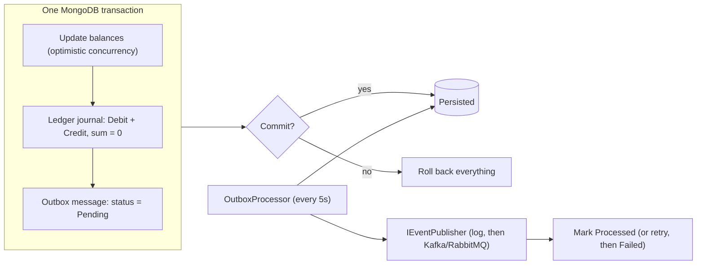
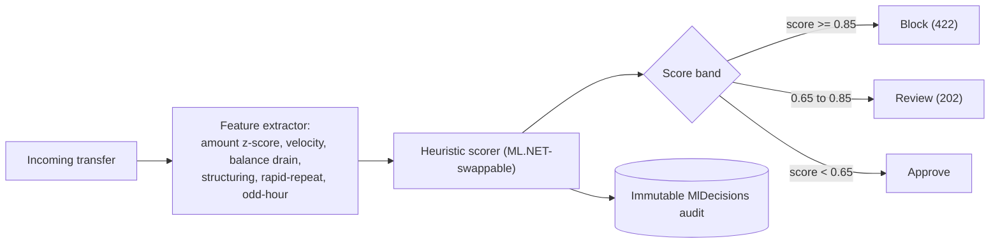
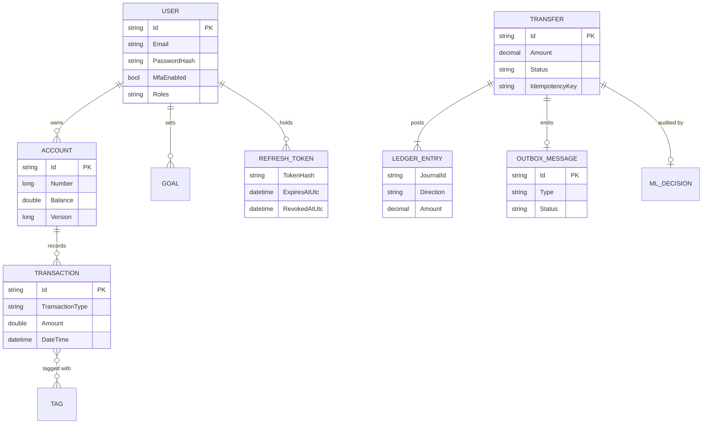
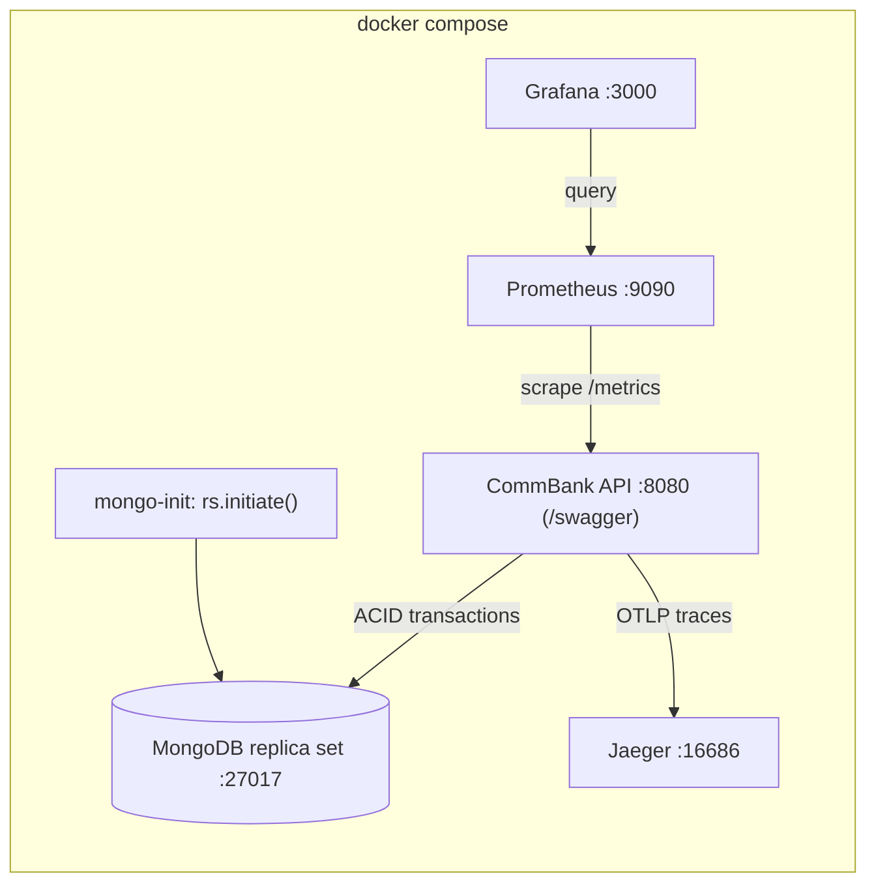
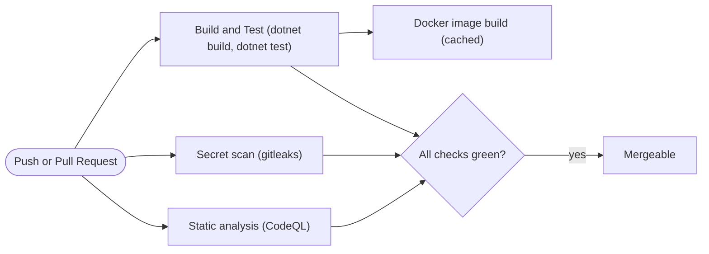

<div align="center">

# CommBank Backend API

**An enterprise-grade, secure-by-default retail and commercial banking backend built on .NET 8 and MongoDB.**

Accounts · Transactions · ACID Fund Transfers · Double-Entry Ledger · Fraud/AML Intelligence · Goals · Tags · Users


</div>

---

## Table of Contents

1. [Overview](#overview)
2. [Engineering Pillars](#engineering-pillars)
3. [System Architecture](#system-architecture)
4. [Modules (Ports and Adapters)](#modules-ports-and-adapters)
5. [Request Pipeline](#request-pipeline)
6. [Fund Transfer Workflow](#fund-transfer-workflow)
7. [Authentication and Step-up MFA](#authentication-and-step-up-mfa)
8. [Double-Entry Ledger and Transactional Outbox](#double-entry-ledger-and-transactional-outbox)
9. [AI / ML Risk Scoring](#ai--ml-risk-scoring)
10. [Data Model](#data-model)
11. [API Surface](#api-surface)
12. [Security](#security)
13. [Observability](#observability)
14. [Resilience](#resilience)
15. [Testing Strategy](#testing-strategy)
16. [Deployment Topology](#deployment-topology)
17. [CI/CD Pipeline](#cicd-pipeline)
18. [Engineering Results: Before and After](#engineering-results-before-and-after)
19. [Configuration and Secrets](#configuration-and-secrets)
20. [Tech Stack](#tech-stack)
21. [Project Structure](#project-structure)
22. [Roadmap](#roadmap)
23. [Author](#author)

---

## Overview

CommBank Backend API is a reference-grade banking backend organised around five non-negotiable engineering
pillars of financial systems. It is a modular ASP.NET Core service on MongoDB, designed with clean ports
and adapters so that every capability is an interface with a swappable implementation.

The composition root (`Program.cs`) is a thin wire-up that calls each module's `AddCommBank*` registration
extension. There is no hand-rolled service instantiation; dependencies are resolved by the container.

---

## Engineering Pillars

| Pillar | How it is satisfied here |
| --- | --- |
| 1. Data consistency and integrity | Multi-document ACID transactions, optimistic concurrency on balances, and a double-entry ledger written inside the same transaction. |
| 2. Idempotency and reliability | `Idempotency-Key` on money movement, with a transactional outbox for guaranteed, exactly-committed event delivery. |
| 3. Security and compliance | JWT with refresh-token rotation and reuse detection, TOTP MFA with step-up elevation, RBAC, secrets from environment/secret store with fail-fast, and no PII in logs. |
| 4. Observability and auditability | Structured JSON logs, OpenTelemetry traces and Prometheus metrics, health probes, and immutable audit trails. |
| 5. Resilience and fault tolerance | Polly circuit breakers and retries, rate limiting, a fail-open/closed risk policy, and RFC 7807 problem responses. |

### Highlights

- Modular hexagonal (ports and adapters) architecture; every capability sits behind an interface.
- Full authentication suite: short-lived JWT access tokens, rotating refresh tokens with reuse detection, RFC 6238 TOTP MFA, and step-up elevation for high-value transfers.
- ACID fund-transfer engine: atomic debit and credit, optimistic concurrency, idempotent retries, and a pre-commit fraud/AML risk gate.
- Double-entry ledger plus transactional outbox: the ledger is the immutable source of truth, and events publish if and only if the transaction commits.
- AI/ML intelligence: explainable fraud scoring, transaction auto-categorization, goal forecasting, and an in-process (LLM-swappable) financial assistant.
- Production observability: Serilog JSON logging, OpenTelemetry tracing (including MongoDB driver spans), Prometheus and Grafana, Jaeger, and health checks.
- One-command stack: `docker compose up` brings up the API, a MongoDB replica set, Prometheus, Grafana, and Jaeger.
- Real integration tests: Testcontainers boots a live MongoDB replica set to prove the ACID, concurrency, and idempotency guarantees.
- CI/CD: build and test, gitleaks secret scanning, CodeQL analysis, and a Docker image build.

---

## System Architecture

The diagram below is a layered, integrated view: clients enter through an ordered middleware edge, reach
thin controllers, which delegate to application modules expressed as ports. Adapters fulfil those ports
against MongoDB and the AI engine, while a background relay drains the outbox and all layers emit telemetry.



Analysis. The edge is deliberately thin: controllers validate, enforce authorization, map domain
exceptions to problem responses, and delegate. All decision logic lives in the application modules behind
ports (`IFundTransferService`, `IRiskScoringService`, `ILedgerService`, and so on), so an implementation
can be replaced (heuristic scorer to a trained model, logging publisher to a broker) without touching any
caller. The only stateful adapter is MongoDB; everything else is stateless and horizontally scalable. See
[`ARCHITECTURE.md`](ARCHITECTURE.md) for the full layering and the target physical project split.

---

## Modules (Ports and Adapters)

| Module | Folder | Ports and default adapters |
| --- | --- | --- |
| Authentication | `Auth/` | `ITokenService`, `IRefreshTokenService`, `ITotpService` to JWT, a Mongo refresh store, and RFC 6238 TOTP |
| Fund Transfers | `Transfers/` | `IFundTransferService` to an ACID Mongo transaction with optimistic concurrency, idempotency, and a risk gate |
| Ledger and Outbox | `Ledger/` | `ILedgerService`, `IOutboxService`, `IEventPublisher` to double-entry postings, a transactional outbox, and a relay |
| AI / ML | `AI/` | `IRiskScoringService`, `ICategorizationService`, `IGoalForecastingService`, `IFinancialAssistantService`, `ILanguageModelClient` |
| Domain Services | `Services/` | `IAccountsService`, `ITransactionsService`, `IGoalsService`, `ITagsService`, `IUsersService` to MongoDB |
| Observability | `Observability/` | Serilog, OpenTelemetry, health checks, `AppDiagnostics` |
| Resilience | `Resilience/` | Polly policies, the built-in rate limiter, and a global exception handler |

---

## Request Pipeline

Every request flows through an ordered middleware chain; the order is significant for correctness.



Analysis. The exception handler is outermost so anything uncaught becomes a problem response rather than a
leaked stack trace. The correlation id is assigned before request logging so every log line for a request
is joinable, and it is echoed on the response and attached to the active trace span. The rate limiter runs
before authentication and any database work, so abusive traffic is shed cheaply; health and metrics
endpoints are exempt from limiting.

---

## Fund Transfer Workflow

A transfer is atomic, idempotent, concurrency-safe, and risk-gated. The debit, the credit, both
transaction records, the two ledger postings, the audit row, and the outbox event all commit (or roll
back) together.



Analysis. Idempotency is enforced by a unique key whose presence short-circuits to a replay, so a client
retry after a network timeout never double-posts. Optimistic concurrency uses an `Account.Version` token:
a balance update is conditional on the expected version, and a lost race raises a conflict that retries the
whole transaction within a bounded budget. Transient transaction errors and unknown commit results are
retried using the driver's error labels. This behaviour is verified end to end by the
`ConcurrentTransfers_HaveNoLostUpdates` integration test against a real MongoDB.

---

## Authentication and Step-up MFA



Analysis. Access tokens are short-lived (15 minutes) and stateless; refresh tokens are long-lived but
persisted only as a SHA-256 hash, so a database leak cannot be replayed. Every refresh rotates the token
and links the old one to its successor. Presenting an already-revoked token is treated as theft: the
service revokes the user's entire active set. MFA is a dependency-free RFC 6238 TOTP implementation;
`mfa/enroll` returns an `otpauth://` URI to scan, `mfa/verify` activates it, and `step-up` mints an
elevated token carrying `acr=mfa`. Transfers at or above the configured threshold require that claim and
otherwise return `403 step_up_required`.

---

## Double-Entry Ledger and Transactional Outbox



Analysis. The balance invariant (sum of debits equals sum of credits) is enforced before any document is
written. Because the ledger postings and the outbox message are written inside the same transaction as the
balance change, the ledger can never diverge from the money, and the event is persisted if and only if the
transfer committed. A background relay drains the outbox and publishes through a swappable publisher port,
retrying up to a bounded number of attempts before parking a message as failed.

---

## AI / ML Risk Scoring



Analysis. The scorer is deterministic and fully explainable: each fired signal contributes weighted points
and an audit-grade reason code (for example `AMOUNT_CRITICAL`, `VELOCITY`, `STRUCTURING`, `RAPID_REPEAT`).
The total is squashed to a 0 to 1 score and banded into an approve, review, or block decision. Every
decision is recorded to an append-only audit collection with the model version and a hash of the feature
vector, never the raw inputs. Because the scorer sits behind `IRiskScoringService`, a trained ML.NET or
remote model can replace it without changing the transfer engine. The module also provides
auto-categorization, goal forecasting, and an in-process financial assistant; see
[`CommBank-Server/AI/README.md`](CommBank-Server-main/CommBank-Server/AI/README.md).

---

## Data Model



Note. Transfer amounts and ledger postings use `decimal` (persisted as Decimal128). The legacy
`Account.Balance` and `Transaction.Amount` remain `double` and are flagged for migration to Decimal128.

---

## API Surface

| Method | Route | Purpose |
| --- | --- | --- |
| POST | `/api/User` | Register a user (open; server-assigned role) |
| POST | `/api/Auth/Login` | Authenticate, returning access + refresh tokens |
| POST | `/api/Auth/Refresh` | Rotate a refresh token |
| POST | `/api/Auth/Logout` | Revoke a refresh token |
| POST | `/api/Auth/mfa/enroll`, `/mfa/verify` | TOTP MFA enrollment and activation |
| POST | `/api/Auth/step-up` | Elevate the session (issue an `acr=mfa` token) |
| POST | `/api/Transfers` | Risk-aware ACID transfer (honours `Idempotency-Key`) |
| GET | `/api/Ledger/transfers/{id}` | The journal for a transfer, with a balanced flag |
| POST | `/api/Intelligence/risk/score` | Score a transaction for fraud/AML |
| POST | `/api/Intelligence/categorize` | Suggest tags for a transaction |
| GET | `/api/Intelligence/goals/{id}/forecast` | Goal completion forecast |
| POST | `/api/Intelligence/assistant` | Natural-language financial assistant |
| GET | `/api/Transaction/page` | Paged transactions |
| GET | `/health/live`, `/health/ready`, `/metrics` | Liveness, readiness, Prometheus metrics |

### Example: authenticate

```http
POST /api/Auth/Login
Content-Type: application/json

{ "email": "tagore@example.com", "password": "Password123" }
```

### Example: risk-aware transfer

```http
POST /api/Transfers
Authorization: Bearer <access-token>
Idempotency-Key: 11111111-1111-1111-1111-111111111111
Content-Type: application/json

{ "sourceAccountId": "<24-hex>", "destinationAccountId": "<24-hex>", "amount": 250.00 }
```

---

## Security

| Control | Status | Detail |
| --- | --- | --- |
| Authentication | Implemented | JWT bearer with strict validation (issuer, audience, lifetime, signature) |
| Refresh tokens | Implemented | Hashed at rest, rotated on use, reuse detection revokes the chain |
| Multi-factor auth | Implemented | RFC 6238 TOTP with enroll/verify and step-up elevation |
| Step-up for high value | Implemented | Transfers above a threshold require an `acr=mfa` token |
| Password hashing | Implemented | BCrypt; the hash is never serialized (`[JsonIgnore]`) |
| Authorization | Implemented | Role-based; broad and destructive operations are admin-only |
| Secret management | Implemented | Environment / user-secrets with fail-fast startup validation |
| Input validation | Implemented | FluentValidation plus data annotations, returning RFC 7807 |
| Transport security | Implemented | HTTPS redirection; environment-aware CORS |

---

## Observability

- Structured logging with Serilog as compact JSON to stdout, with a bootstrap logger for startup failures.
- Distributed tracing with OpenTelemetry across ASP.NET Core, outbound HttpClient, and the MongoDB driver, plus a custom application activity source. Traces export to Jaeger over OTLP.
- Metrics with OpenTelemetry, exposed at `GET /metrics` for Prometheus, including custom counters such as completed and blocked transfers.
- Health probes: `GET /health/live` (liveness) and `GET /health/ready` (readiness, including a MongoDB ping).
- A pre-provisioned Grafana dashboard for transfer throughput, blocked transfers, amount distribution, and request rate.

See [`CommBank-Server/Observability/README.md`](CommBank-Server-main/CommBank-Server/Observability/README.md).

---

## Resilience

- Outbound HTTP resilience with Polly: retry with exponential backoff and jitter, a circuit breaker, and a per-attempt timeout, composed onto a named `resilient` HttpClient.
- Rate limiting using the built-in .NET 8 limiter, partitioned per client IP with a fixed window; health and metrics endpoints are exempt.
- A fail-open / fail-closed policy in the transfer engine: scoring failures degrade open for low-value transfers and closed (block) above a configurable amount.
- A global exception-handling middleware that converts anything uncaught into an RFC 7807 problem response carrying the trace and correlation ids.

---

## Testing Strategy

```bash
dotnet test CommBank-Server-main/Server.sln
```

- Unit tests (no infrastructure): the risk engine, categorizer, forecaster, and transfer validator, using fake services.
- Integration tests (`CommBank.Tests/Integration`, require Docker): a `MongoReplicaSetFixture` boots `mongo:6` as a single-node replica set and proves, against real MongoDB:
  - atomic debit and credit;
  - idempotent replay on a repeated key;
  - insufficient-funds rollback;
  - no lost updates under concurrent transfers;
  - a balanced ledger journal plus one outbox event per transfer.

---

## Deployment Topology

`docker compose up --build` launches the full platform.



| Service | URL |
| --- | --- |
| API (Swagger) | http://localhost:8080/swagger |
| Metrics | http://localhost:8080/metrics |
| Grafana (dashboard auto-provisioned) | http://localhost:3000 |
| Prometheus | http://localhost:9090 |
| Jaeger (traces) | http://localhost:16686 |

Full guide: [`DEPLOY.md`](DEPLOY.md).

---

## CI/CD Pipeline



Workflow: [`.github/workflows/ci.yml`](.github/workflows/ci.yml).

---

## Engineering Results: Before and After

This repository was hardened from a leaky learning prototype into a production-shaped service.

| Area | Before | Now |
| --- | --- | --- |
| Secrets | Live MongoDB credential committed in `Secrets.json` | Scrubbed, gitignored, layered fail-fast config, incident runbook |
| Authentication | `Login` returned `204` with no token | JWT plus refresh rotation (reuse detection), TOTP MFA, step-up, RBAC |
| PII | `User.Password` hash serialized to clients | `[JsonIgnore]`, registration via DTO, no privilege escalation |
| Money movement | Insert-only, no balance update, no atomicity | ACID transfer, optimistic concurrency, idempotency, double-entry ledger, outbox |
| Fraud / AML | None | Real-time explainable risk scoring with an immutable audit trail |
| Observability | Console-level | Serilog JSON, OpenTelemetry, Prometheus and Grafana, Jaeger, health |
| Resilience | None | Polly circuit breaker and retry, rate limiting, global exception handler |
| Platform | .NET 6 (end of life), manual `new` DI | .NET 8 LTS, interface-based DI, built-in rate limiter |
| Testing | A few fake-based unit tests | Plus Testcontainers integration tests against a real Mongo replica set |
| Delivery | None | Docker Compose stack and GitHub Actions CI/CD (build, test, scan) |

---

## Configuration and Secrets

Configuration is layered: `appsettings.json`, then an optional gitignored `Secrets.json`, then user-secrets
in development, then environment variables (authoritative). The application fails fast at startup if the
MongoDB connection string or `Jwt:SigningKey` is missing.

```powershell
# local development: set the two required secrets
dotnet user-secrets set "ConnectionStrings:CommBank" "<mongodb+srv URI>"

$bytes = New-Object 'System.Byte[]' 48
[System.Security.Cryptography.RandomNumberGenerator]::Create().GetBytes($bytes)
dotnet user-secrets set "Jwt:SigningKey" ([Convert]::ToBase64String($bytes))
```

Multi-document transactions require a replica set (MongoDB Atlas, or the bundled single-node replica set in
`docker-compose.yml`).

---

## Tech Stack

- Runtime: ASP.NET Core (.NET 8 LTS), MongoDB.Driver
- Authentication: JWT bearer, BCrypt, RFC 6238 TOTP
- AI/ML: in-process explainable scoring (ML.NET-ready), LLM-swappable assistant
- Observability: Serilog, OpenTelemetry, Prometheus, Grafana, Jaeger
- Resilience: Polly, the built-in .NET rate limiter
- API: Swagger/OpenAPI, API versioning (Asp.Versioning), FluentValidation, pagination
- Testing: xUnit, Testcontainers
- Delivery: Docker Compose, GitHub Actions (build/test, gitleaks, CodeQL)

---

## Project Structure

```text
CommBank-Backend-API-main/
  docker-compose.yml, Dockerfile, .dockerignore
  ARCHITECTURE.md, DEPLOY.md, SECURITY-INCIDENT-RUNBOOK.md
  .github/workflows/ci.yml
  deploy/                       Prometheus config, Grafana provisioning + dashboard
  CommBank-Server-main/
    Server.sln
    CommBank-Server/
      Program.cs                thin composition root (AddCommBank* modules)
      Controllers/              Auth, User, Account, Transaction, Transfer, Goal, Tag, Intelligence, Ledger
      Services/                 Mongo domain services + AddCommBankPersistence
      Models/                   entities, DTOs, pagination
      Auth/                     JWT, refresh tokens, TOTP, step-up
      AI/                       ports + adapters (risk, categorize, forecast, assistant) + README
      Transfers/                FundTransferService (ACID) + README
      Ledger/                   double-entry + outbox + processor + README
      Observability/            Serilog, OpenTelemetry, health + README
      Resilience/               Polly, rate limiter, exception handler
      Validation/               FluentValidation validators
    CommBank.Tests/             unit tests + Integration/ (Testcontainers)
```

---

## Roadmap

- Compile and run the full suite (`dotnet build` and `dotnet test` with Docker available).
- Physical project split: `CommBank.Domain`, `CommBank.Application`, `CommBank.Infrastructure`, `CommBank.Api`.
- Replace the logging event publisher with a real Kafka or RabbitMQ adapter.
- Hosted-LLM assistant through `ILanguageModelClient` (Anthropic/OpenAI).
- Redis caching and an Azure Kubernetes Service (AKS) deployment.

---

## Author

**Tagore Nand** — [github.com/TagoreNand](https://github.com/TagoreNand)

<div align="center">

A portfolio-grade demonstration of fintech backend design, secure-by-default engineering,
distributed-systems consistency, and production observability.

</div>
